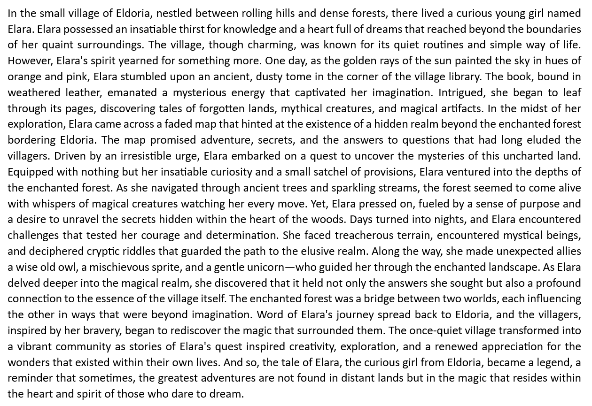
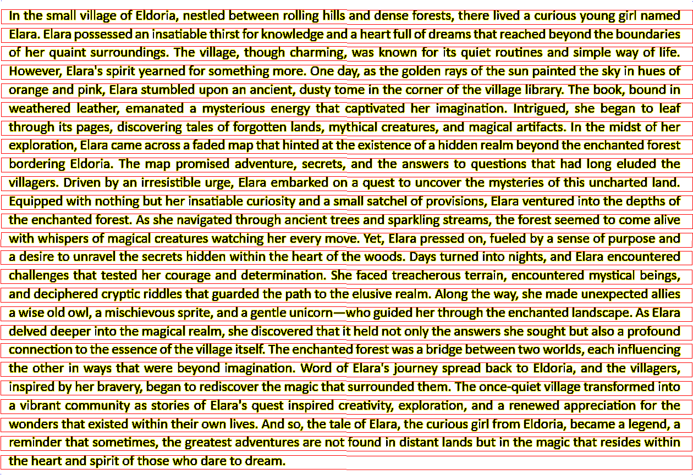
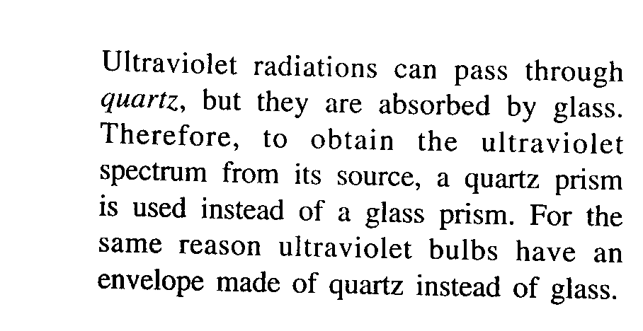
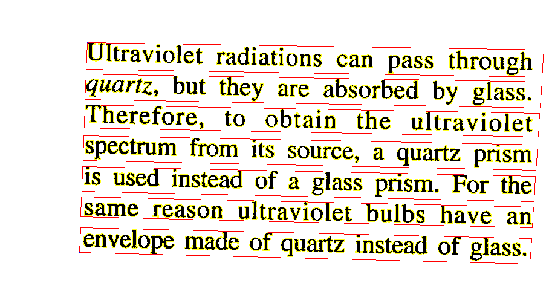
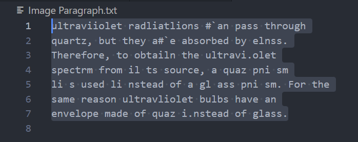

# Optical Character Recognition using Self-Developed Image Processing Methods

## Description
This project was undertook during the 2020 Covid lockdown (March - Dec) when I was 17, reflects my passion for systems capable of emulating human tasks. Originally named "Text Recognition," it is an Optical Character Recognition (OCR) project designed to detect characters in an image and transcribe them into a text file. Employing algorithms I researched and developed, notably the Path Finder and the Letter Tracer, this project was born out of a desire to explore systems that mimic human cognition.

## Motivation
This project was developed when I did not have the exposure to Deep Learning Methods and was not aware of the field, this project represents my mindset of self-learning and exploration. My mindset during this project was to completely self-develop the algorithms and the architecture required, to gain knowledge, experience and develop critical thinking and problem solving. 

## Features
- Designed for images with a white background and lowercase English letters (excluding special characters), specifically developed for the Calibri font.
- Sample images are provided in the "Images" folder, with the main function written in "ReadImage.java".
- Image format must be ".bmp".
- Output text will be generated in a text file named "ImageParagraph.txt".
- An image "SegmentedImage.bmp" will be generated to present the Line and character segmentation.

## Disclaimer
As I upload this project to GitHub along with my other older projects, it's important to note that I am presenting it in its original form, without modifications. Therefore, the concepts and coding style reflect my skills and knowledge as of 2020, rather than my current capabilities. Please overlook any technical or logical errors in the project.

## Usage
1. Clone the repository.
2. Place the images you want to process in the "Images" folder.
3. Open the "ReadImage.java" file to give the Image Name in the "ImageName" variable 
4. Run the main function to initiate the OCR process.
4. View the output text file "ImageParagraph.txt" containing the transcribed characters.
5. View the "SegmentedImage.bmp" to see the line and character segmentation.

## Sample Output

### Sample Input Image 1: Example of a paragraph image used for Optical Character Recognition (OCR) processing.

### Sample Output 1: Segmented Image

### Sample Output 1: Image converted to text.

ln the small yillage of Eldoria. nestled between roiling hiiis and dense forests. there lived a #`urious voung girl named
Eiara. Elara possessed an insatiabiethirst for knowiedge and a hear full of dreamsthat reached beuond the boundaries
of her quaint surroundings. The viilage. though charming, was known for its quiet routines and simple wav of life.
However. Elarals spirit yearned for something more. one dan. as the golden ravs of the sun painted the sk in hues of
orange and pink. Elara stumbied upon an ancient. dustn tome in the #`orner of the village librar. The book. bound in
weathered leather. emanated a mnsterious energ that #`aptivated her imagination. lntrigued. she began to leaf
through its pages. discoyering tales of forgoten iands, myhical #`reatures. and magical arifacs. ln the midst of her
exploration. Elara came across a faded map that hinted at the existence of a hidden realm beuond the enchanted forest
bo rdering Eldoria. The map promised adyenture. secrets. and the answers to questions that had long eluded the
vi i lagers. oriyen by an irresistible urge. Eiara embarked on a quest to un#`oyer the mnsteries of this unchared land.
Eq u i pped with nothing but her insatiabie curiositu and a small sat#`hel of proyisions, Elara yentured into the depths of
the enchanted forest. As she navigated through an#`ient trees and sparkling streams. the forest seemed to come alive
with whispers of magicai creatures watching her eyeru moye. yet. Elara pressed on. fueled bu a sense of purpose and
a desire to unravei the secrets hidden within the hear of the woods. oaus turned into nights. and Elara encountered
chaiienges that tested her courage and determination. she fa#`ed treacherous terrain. encountered mnstical beings,
and de#`iphered #`ruptic riddles that guarded the path to the elusive realm. Along the way, she made unexpected allies
a wi se old owl. a mis#`hieyous sprite. and a gentle unicorn-who guided her through the enchanted landscape. As Elara
delved deeper into the magi#`ai reaim. she discovered that it held not onln the answer she sought but also a profound
connection to the essence ofthe viiiage itseif. The en#`hanted forest was a bridge beteen two worlds. each infuencing
the other in waus that were beyond imagination. word of Elarals diournev spread back to Eldoria. and the villagers,
inspired bn her brayer. began to rediscover the magic that surrounded them. The onceiquiet village transformed into
a yi brant communitn as stories of Eiarals quest inspired #`reativit. exploration, and a renewed appreciation for the
wonders that existed within their own lives. And so. the tale of Elara. the curious girl from Eldoria. be#`ame a legend. a
reminder that sometimes. the greatest adventures are not found in distant lands but in the magic that resides within
the hear and spirit of those who dare to dream.
===========================================================================================================================

### Sample Input Image 2: Example of a paragraph image used for Optical Character Recognition (OCR) processing.

### Sample Output 2: Segmented Image

### Sample Output 2: Image converted to text.

ultraviiolet radliatlions #`an pass through
quartz, but they a#`e absorbed by elnss.
Therefore, to obtailn the ultravi.olet
spectrm from il ts source, a quaz pni sm
li s used li nstead of a gl ass pni sm. For the
same reason ultravliolet bulbs have an
envelope made of quaz i.nstead of glass.
