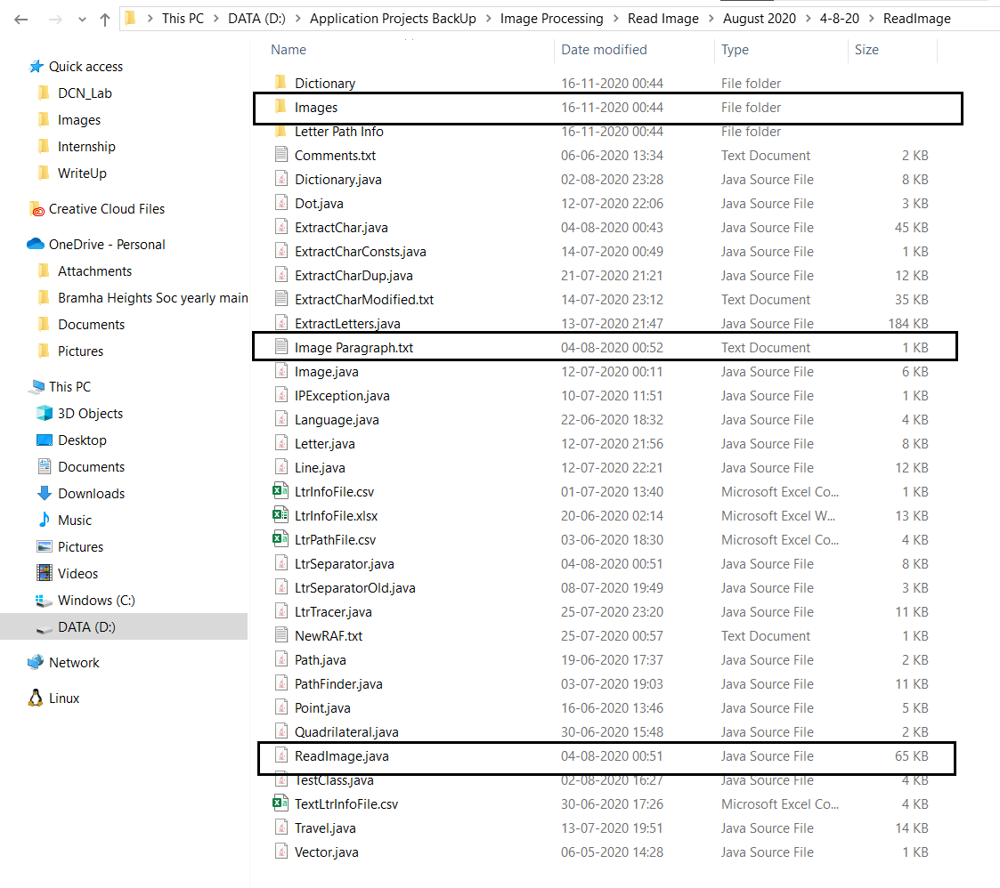
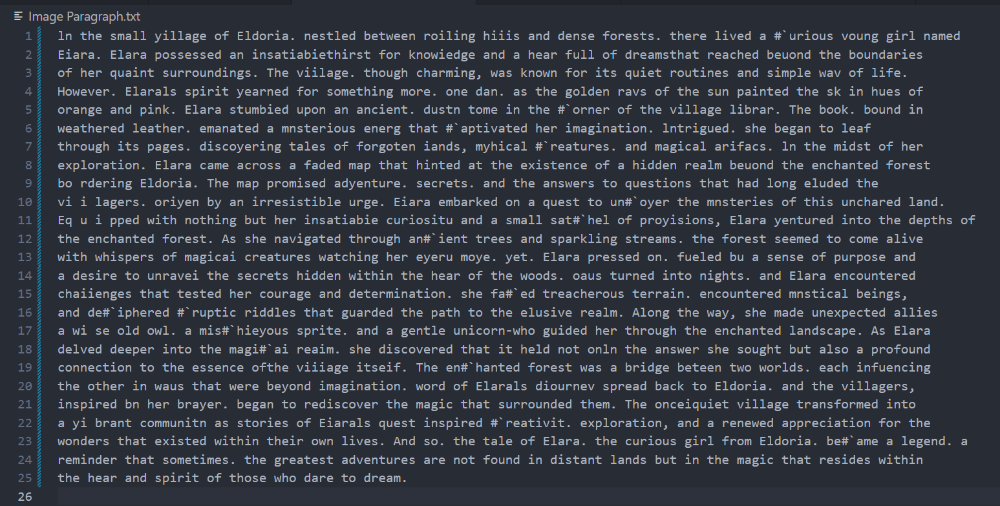

# Letter Tracer Algorithm - Optical Character Recognition

## Disclaimer
**This project was undertook during the 2020 Covid lockdown (March - Dec) when I was 17. As I upload this project to GitHub along with my other older projects, it's important to note that I am presenting it in its original form, without modifications. Therefore, the concepts and coding style reflect my skills and knowledge as of 2020, rather than my current capabilities.** Please overlook any technical or logical errors in the project.

## Description
This project reflects my passion for systems capable of emulating human tasks. Originally named "Text Recognition," it is an Optical Character Recognition (OCR) project designed to detect characters in an image and transcribe them into a text file. Employing algorithms I researched and developed, notably the Letter Tracer, this project was born out of a desire to explore systems that mimic human cognition.

## Motivation
This project was developed when I did not have the exposure to Deep Learning Methods and was not aware of the field, this project represents my mindset of self-learning and exploration. My mindset during this project was to completely self-develop the algorithms and the architecture required, to gain knowledge, experience and develop critical thinking and problem solving. 

## Features
- Designed for images with a white background and lowercase English letters (excluding special characters), specifically developed for the Calibri font.
- Sample images are provided in the "Images" folder, with the main function written in "ReadImage.java".
- Image format must be ".bmp".
- Output text will be generated in a text file named "ImageParagraph.txt".
- An image "SegmentedImage.bmp" will be generated to present the Line and character segmentation.

## Usage
1. Clone the repository.
2. Place the images you want to process in the "Images" folder.
3. Open the "ReadImage.java" file to give the Image Name in the "ImageName" variable 
4. Run the main function to initiate the OCR process.
4. View the output text file "ImageParagraph.txt" containing the transcribed characters.
5. View the "SegmentedImage.bmp" to see the line and character segmentation.

## Sample Output

### Sample Input Image 1: Example of a paragraph image used for Optical Character Recognition (OCR) processing.

### Sample Output 1: Segmented Image

### Sample Output 1: Image converted to text.

### Sample Input Image 2: Example of a paragraph image used for Optical Character Recognition (OCR) processing.

### Sample Output 2: Segmented Image

### Sample Output 2: Image converted to text.

